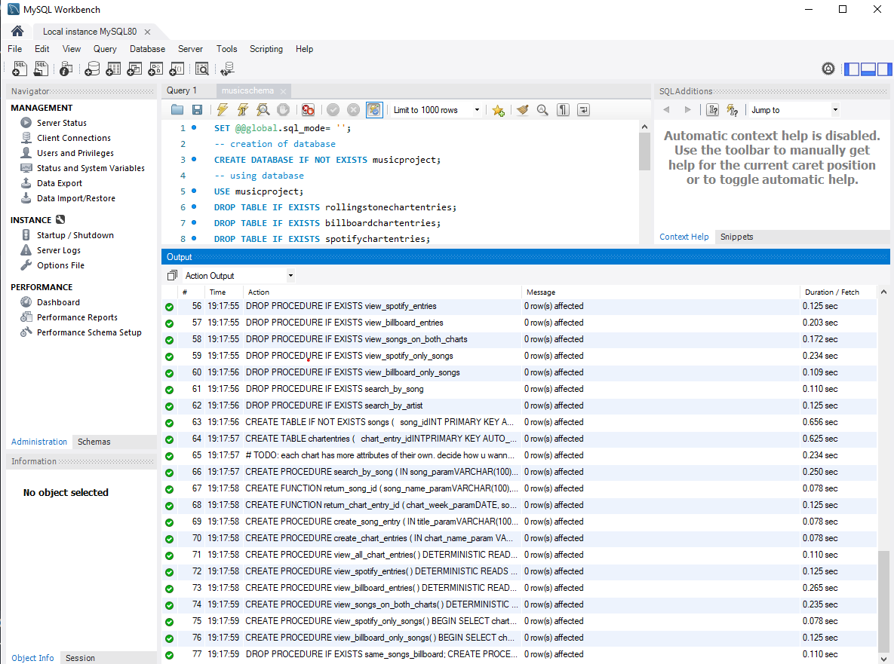
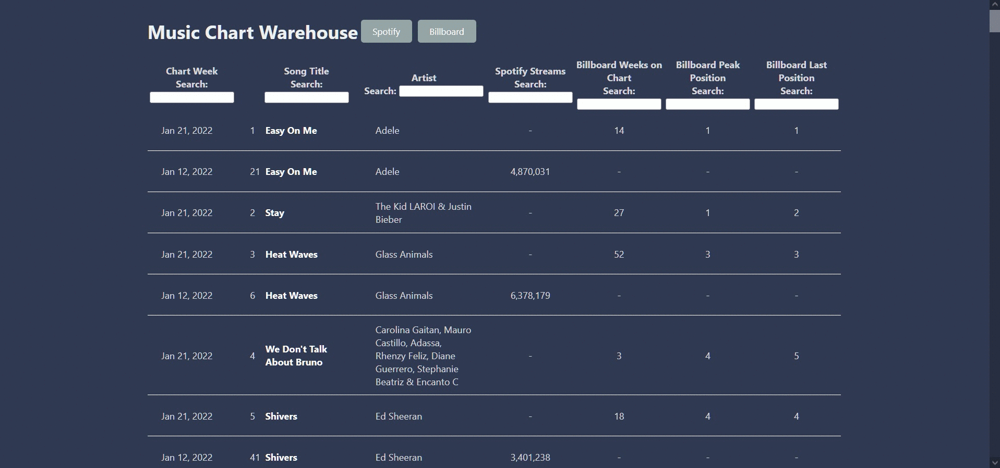

# Music Charts Warehouse

Music Charts Warehouse is a simple web app designed to compile music chart data from different sources. As of now, it is taking data from [Spotify's Weekly US Chart](https://spotifycharts.com/regional/us/weekly/latest) and [Billboard's Hot 100](https://www.billboard.com/charts/hot-100/).

## Prerequisites

Make sure you have installed all of the following prerequisites on your machine:

* [Git](https://git-scm.com/downloads)
* [Node.js](https://nodejs.org/en/)
* [MySQL Workbench and MySQL Server](https://dev.mysql.com/downloads/installer/).  
  * Installer. Custom -> One instance of MySQL Server and MySQL Workbench. I use the 8.0 Versions. -> Type and Networking. Leave as is, Development Computer. Accounts and Roles: Take note of your password, as this will be used in a configuration file later on. -> Windows Service. Leave as is.  
     Start the Workbench and verify connection to local server by selecting Local instance and typing `show databases;` in the query. Execute the command (the lightning bolt) You should see `information_schema`, `mysql`, `performance_schema`, and `sys`.

## Installation

### Setting up the back end and the database

Clone the repository:

```bash
git clone https://github.com/dorothysyu/music-charts-warehouse
```

To set up the backend, navigate to the `/charts_app/server` directory.  

>Optional step, but highly recommended for convenience and many advantages as [outlined here](https://towardsdatascience.com/venvs-pyenvs-pipenvs-oh-my-2411149e2f43): [Create and activate a virtual environment](https://docs.python.org/3/library/venv.html) in the server directory.  
>
> * Make sure it's activated by running `which python`. The console should return the path of the python version in your virtual environment.  

Then, still in the `server` directory, install the necessary Python packages from requirements.txt with the command:

```bash
pip install -r requirements.txt
```

There should now be the necessary packages installed in your library (If you decided to use a venv, this would be your`[your venv directory]/Lib/site-packages` directory)

Then, create a file named `chartsconfig.ini` in the `server/lib` directory. In it, you will type:

```ini
[mysql]
host = localhost
db = musicproject
user = [username]
password =[password]
```

> Note: The default user is `root.` The password is your MySQL password you set up earlier. Make sure there is no extraneous whitespace before typing in your password.

To set up the database, open MySQL Workbench. Select and open the local instance. Go to File -> Open SQL Script -> `[path to music-charts-warehouse]\charts_app\server\lib` -> Select `musicschema`. Execute the file (this is the yellow lightning bolt in the toolbar above the editor). After running it, it should look something like this:



In the `charts_app/server` directory, run the command  

```bash
python ./lib/chart_connection.py
```

This establishes connection the MySQL database and scrapes the data from the websites. To confirm that it was successful, run

```bash
python ./lib/console_view.py
```

to see what is in the database.

### Setting up the front end

To set up the front end, navigate to `charts_app/client`.  
Run the command

```javascript
npm install
```

This will take a few minutes. Then run the command

```javascript
npm start
```

This should open your default browser to localhost:3000, where you will see and can interact with the web app.

---

## Current Demo



## Roadmap

* [x] Scrape Spotify
* [x] Scrape Billboard
* [x] Add column sorting
* [x] Standardize week date range for different charts
  * [x] Do this by creating a new week field
  * [ ] Test that same songs from different weeks are the same song in `is_same_song`
* [ ] Add filtering
  * [ ] Add chart week drop down menu
* [ ] Put online?
  * [ ] Use AWS MySQL
  * [ ] Host client app somewhere

## Built With

* Python
* MySQL
* React.js
* HTML
* CSS

## Acknowledgements

* [Traversey Media](https://youtu.be/w7ejDZ8SWv8), for teaching me React!
* My database professor/class from Northeastern University
* [This guide, for teaching how to scrape data from websites](https://jennifer-franklin.medium.com/how-to-scrape-the-most-popular-songs-on-spotify-using-python-8a8979fa6b06)
